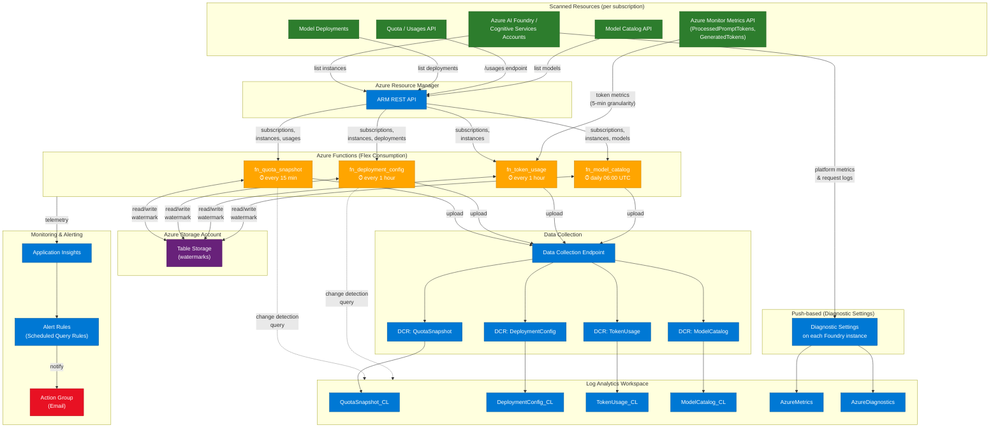

# Architecture Diagram

## Legend

| Color | Meaning |
|-------|---------|
| 🟢 Green | Scanned resources (Azure AI Foundry / Cognitive Services) |
| 🟠 Orange | Azure Functions (timer-triggered ingestion) |
| 🔵 Blue | Azure platform services (ARM, DCE, DCRs, Log Analytics, App Insights) |
| 🟣 Purple | Azure Table Storage (watermark tracking) |
| 🔴 Red | Alert action group (email notifications) |

## Data Flows

**Pull-based ingestion** — Four timer-triggered Azure Functions scan resources via the ARM REST API and Azure Monitor Metrics API, then write to custom Log Analytics tables through the Logs Ingestion API (DCE → DCR → table):

| Function | Schedule | Source | Target Table |
|----------|----------|--------|--------------|
| `fn_quota_snapshot` | Every 15 min | ARM `/usages` endpoint | `QuotaSnapshot_CL` |
| `fn_deployment_config` | Every 1 hour | ARM `/deployments` endpoint | `DeploymentConfig_CL` |
| `fn_token_usage` | Every 1 hour (30-min delay) | Azure Monitor Metrics API | `TokenUsage_CL` |
| `fn_model_catalog` | Daily at 06:00 UTC | ARM model catalog API | `ModelCatalog_CL` |

**Push-based telemetry** — Diagnostic Settings on each Azure AI Foundry / Cognitive Services instance stream platform metrics and per-request logs directly to `AzureMetrics` and `AzureDiagnostics` tables.

**Monitoring** — Application Insights collects function telemetry. Scheduled query alert rules monitor for failures and notify via an Action Group (email).
